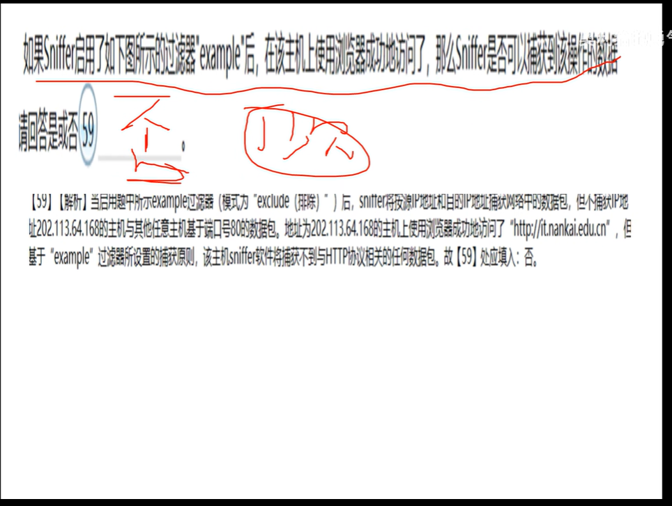
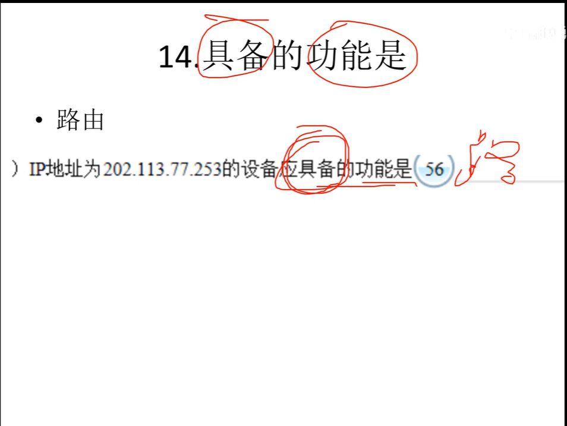
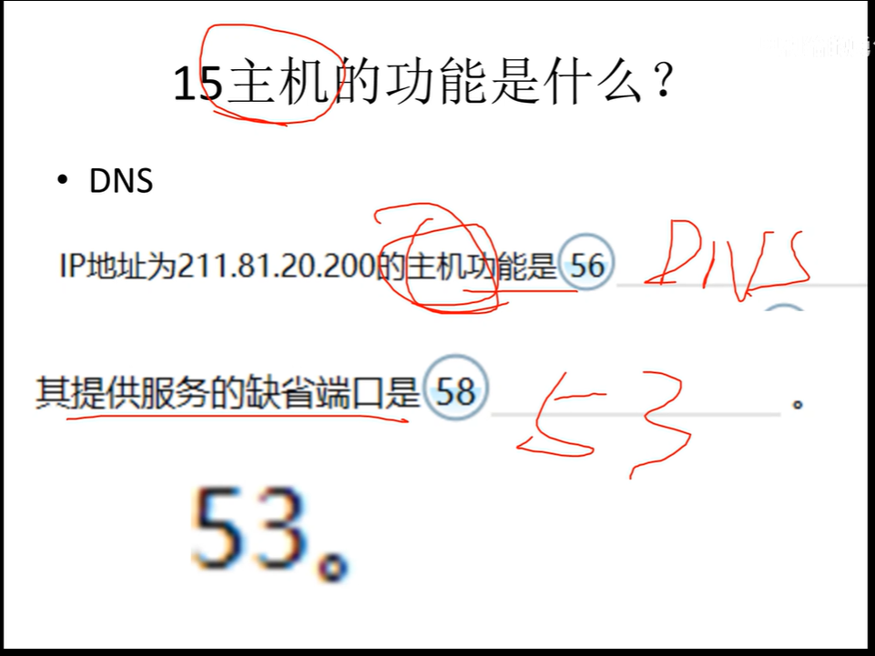
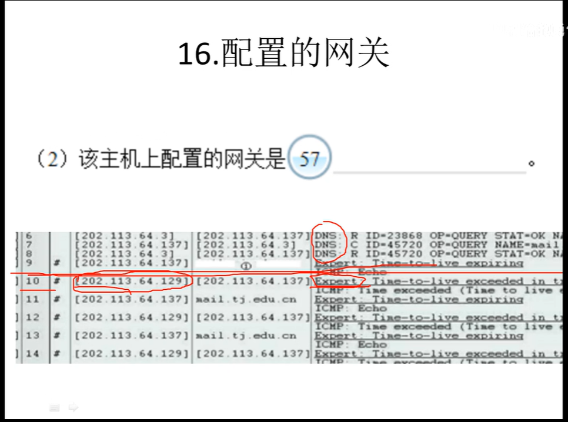

1.dns域名解析
C：s发给dns
R：dns发给s
name后面是域名
dest address内的网址是上网地址

2.tcp三次握手
三次握手完下一次填get

3.ftp
destination address后面填域名即可

4.url
端口是21    ftp://
端口是80     http://
端口是443    https://

5主机执行什么命令
出现ftp   命令是：ftp 域名
time-to-live和echo 命令：tracert 域名
echo（ping）或echo reply 命令：ping 域名 

6主机ip/dns服务器ip

开头为dns c的source address为主机ip
开头为dns r的source address为服务器ip（dnsservers）
dns中c请求，r回复

彩虹ping：1.2为主机ip
         3.4为dns服务器ip

7.protocol
protocol=1（ICMP）
protocol=6 （TCP）
protocol=17（UDP）

8.type

type=0(Echo-reply)
type=8(Echo)
type=11(Time Exceeded)

9.网络号的长度：28

10.主机是什么服务器，其提供服务端端口？
FTP--21
DNS--53
DHCP--67
HTTP--80
HTTPS--443

11.sniffer捕获分析
回放捕获的数据包，使用sniffer内置的：数据包生成器
显示捕获的所有数据包，使用sniffer内置的：DNS域名解析

12.执行Tract命令（TTL和ICMP）时：
IP地址-->域名

13.destination
destination adderss=主机对应ip地址+域名

14.具备的功能是：
路由

15.主机的功能：DNS
缺省端口：53

16.配置的网关
expert的第一个

17.打开的窗口
Protocol Distribution

18.被访问的网站端口：
Source port后面

19彩虹皮（ping）找mac地址
Dst后面的括号（蓝色第二行最后）

20.addr后面是主机ip地址

